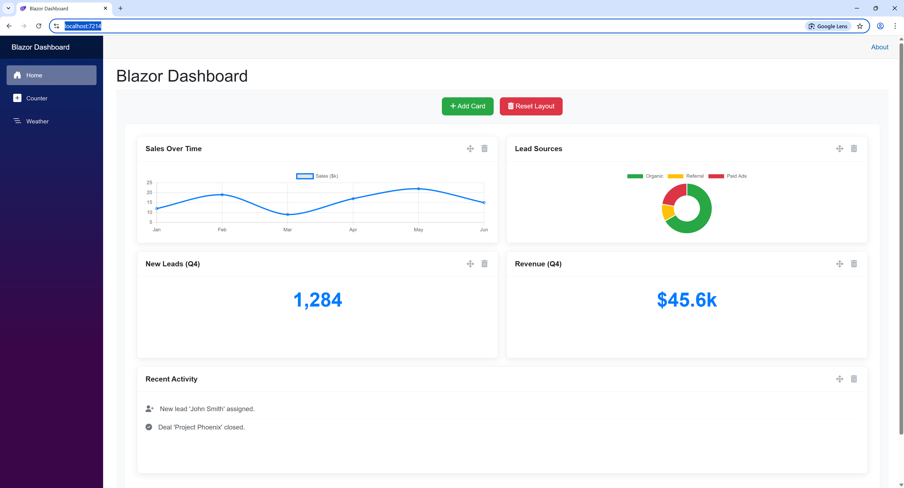

# Blazor Dashboard



**Blazor Dashboard** is a powerful and flexible dashboard component for Blazor WebAssembly (WASM) applications. It provides a dynamic grid-based layout where users can add, remove, drag, and resize cards. The layout state is automatically persisted to the browser's local storage, ensuring a consistent user experience across sessions.

This component is built to leverage the power of JavaScript libraries like [GridStack.js](https://gridstackjs.com/) and [Chart.js](https://www.chartjs.org/) for rich, interactive UIs, all managed from C# code.

## ✨ Features

-   **Dynamic Grid Layout**: Powered by GridStack.js, cards can be freely dragged and resized.
-   **Persistent Layouts**: Automatically saves the position, size, and state of all cards to `localStorage`.
-   **Customizable Card Content**: Use Blazor's `RenderFragment` pattern to define the content inside each card, allowing for any Blazor component, including data visualizations with Chart.js.
-   **Runtime Card Management**: Users can add new cards and delete existing ones through the UI.
-   **Reset to Default**: A single-click option to reset the layout to its initial configuration.
-   **Two-Way Communication**: Seamlessly integrated with JavaScript, allowing Blazor to control the grid and the grid to report changes back to Blazor.

## ⚙️ Dependencies

This project uses **LibMan (Library Manager)** to download and manage client-side dependencies. This ensures that all necessary JavaScript and CSS files are hosted locally within your application, avoiding reliance on external CDNs and improving load times.

The following libraries are required:

1.  **GridStack.js**: The core library for the grid system.
2.  **Chart.js**: For rendering data visualizations and charts.
3.  **Font Awesome**: For icons used in the UI controls.
4.  **Custom JavaScript Interop file**: A `dashboard-manager.js` file to bridge Blazor and the JS libraries.

You can restore these packages by adding a `libman.json` file to your project's root and running `libman restore` in your terminal, or by right-clicking the file in Visual Studio and selecting "Restore Client-Side Libraries".

**Example `libman.json`:**
```json
{
  "version": "1.0",
  "defaultProvider": "cdnjs",
  "libraries": [
    {
      "library": "gridstack.js@9.5.1",
      "destination": "wwwroot/lib/gridstack",
      "files": [
        "gridstack.min.js",
        "gridstack.min.css",
        "gridstack-extra.min.css"
      ]
    },
    {
      "library": "Chart.js@4.4.1",
      "destination": "wwwroot/lib/chart.js",
      "files": [
        "chart.umd.min.js"
      ]
    },
    {
      "library": "font-awesome@6.5.1",
      "destination": "wwwroot/lib/font-awesome",
      "files": [
        "css/all.min.css",
        "webfonts/"
      ]
    }
  ]
}
```

---

## 📬 Contact

Don Potts - Don.Potts@DonPotts.com